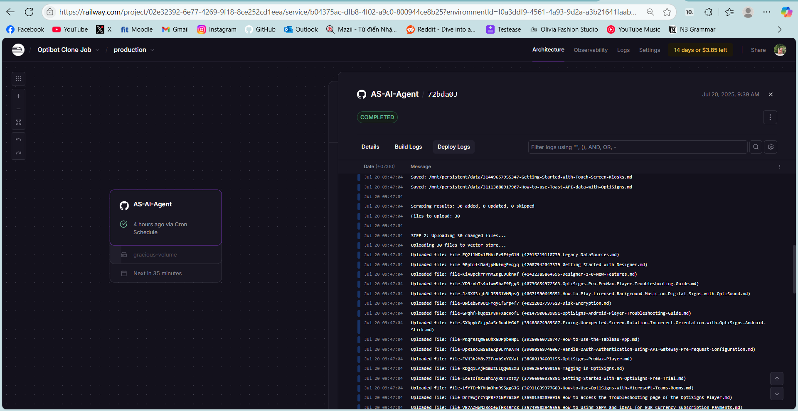
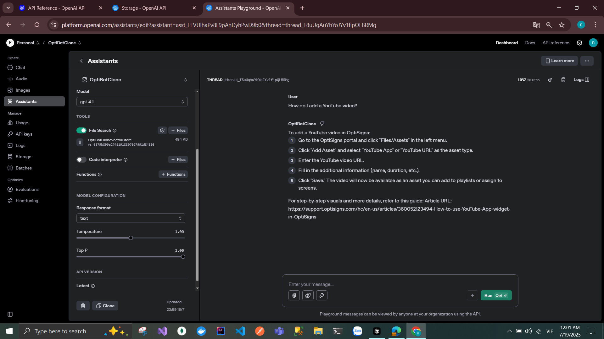

# Optibot Clone Job

## 1. Setup

- This project requires **Python 3.10 or higher**. Make sure it is installed.
- Create an account on [OpenAI Platform](https://platform.openai.com/) if you don’t have one.
- Obtain your **OpenAI API key**.
- (Optional) Create a **Vector Store** at [OpenAI Vector Stores](https://platform.openai.com/storage/vector_stores).  
  If you skip this, the script will create one automatically.
- Copy `.env.example` to `.env` and provide the required values as described in the example.

---

## 2. Running Locally

1. Clone the project:
   ```bash
   git clone https://github.com/Wendiago/AS-AI-Agent.git
   cd AS-AI-Agent
   ```

2. Create a virtual environment:
   ```bash
   python -m venv .venv
   ```

3. Activate the virtual environment:
   - **Windows (PowerShell):**
     ```bash
     .venv\Scripts\Activate
     ```
   - **macOS/Linux:**
     ```bash
     source .venv/bin/activate
     ```

4. Install dependencies:
   ```bash
   pip install -r requirements.txt
   ```

5. Run the job:
   ```bash
   python main.py
   ```

6. Notes:
   - All `.md` files are downloaded to the `DATA_DIR` folder (defaults to `data/`).
   - Logs are stored in the `LOG_DIR` folder (defaults to `logs/`).
   - A `hashes.json` file will be created at the project root.

---

## 3. About the Project

- This project is hosted on **Railway** as a scheduled cron job.
- **Chunking Strategy Used**:
  ```json
  {
    "type": "static",
    "static": {
      "max_chunk_size_tokens": 1200,
      "chunk_overlap_tokens": 200
    }
  }
  ```

### Why These Values?

- **Max chunk size (1200–1500 tokens):**  
  Larger chunks maintain the natural structure of articles (paragraphs, sections, headings).  
  Markdown elements like headers, lists, and code blocks are better preserved, keeping documents coherent.

- **Chunk overlap (150–200 tokens):**  
  Smaller than the default (400 tokens) to reduce redundancy, while still preventing important information from being lost at chunk boundaries.

---

## 4. Daily Job Log Screenshots

-   
-   
-   
-   

---

## 5. Playground Screenshot

- 
